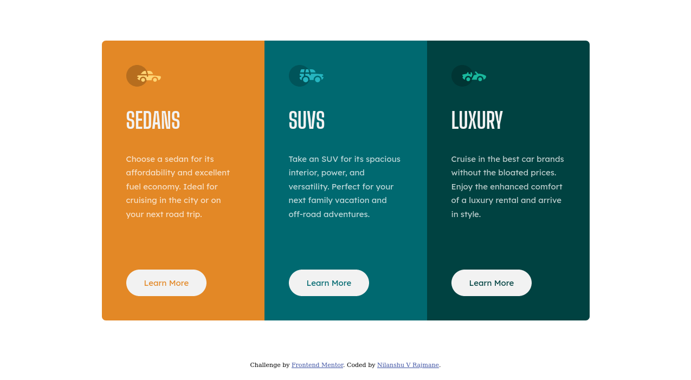

# Frontend Mentor - 3-column preview card component solution

This is a solution to the [3-column preview card component challenge on Frontend Mentor](https://www.frontendmentor.io/challenges/3column-preview-card-component-pH92eAR2-). Frontend Mentor challenges help you improve your coding skills by building realistic projects. 

## Table of contents

- [Overview](#overview)
  - [The challenge](#the-challenge)
  - [Screenshot](#screenshot)
  - [Links](#links)
- [My process](#my-process)
  - [Built with](#built-with)
  - [What I learned](#what-i-learned)
  - [Continued development](#continued-development)
  - [Useful resources](#useful-resources)
- [Author](#author)
- [Acknowledgments](#acknowledgments)

**Note: Delete this note and update the table of contents based on what sections you keep.**

## Overview

### The challenge

Users should be able to:

- View the optimal layout depending on their device's screen size
- See hover states for interactive elements

### Screenshot




### Links

- Solution URL: [Github](https://github.com/nilanshu96/3-column-preview-card-component)
- Live Site URL: [Live Website](https://nilanshu96.github.io/3-column-preview-card-component/)

## My process

### Built with

- Semantic HTML5 markup
- CSS custom properties
- Flexbox

### What I learned

I learnt how to force flex items to use equal space. Below code forces all the items in a flex container to have equal size. This is achieved by making flex-grow and flex-shrink zero. Making them both zero won't allow the children to grow or shrink. And then making flex-basis 100%. This makes the children take the entire space provided by the flex-container as flex-basis is considered the initial size of the flex-item.

```css
.flex-container {
  display: flex;
}
.flex-container > * {
  flex: 0 0 100%;
}
```

### Continued development

I would continue experimenting more with flex layout as I still sometimes encounter unpredictable behavior.

### Useful resources

- [Stackoverflow](https://stackoverflow.com/questions/40351223/equal-width-flex-items-regardless-of-content-length) - This helped me with sizing content equally in flexbox

## Author

- Website - [Nilanshu V Rajmane](https://github.com/nilanshu96)
- Frontend Mentor - [@nilanshu96](https://www.frontendmentor.io/profile/nilanshu96)
- Twitter - [@nilanshu96](https://www.twitter.com/nilanshu96)
